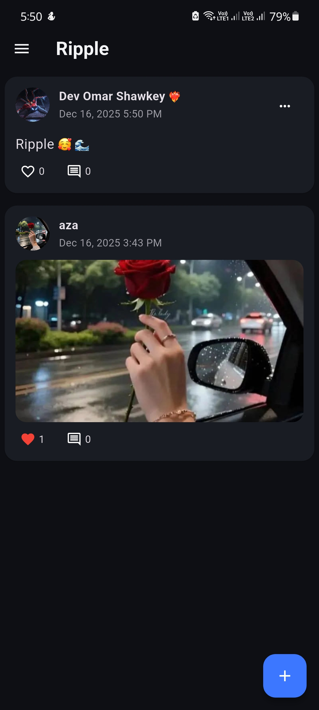
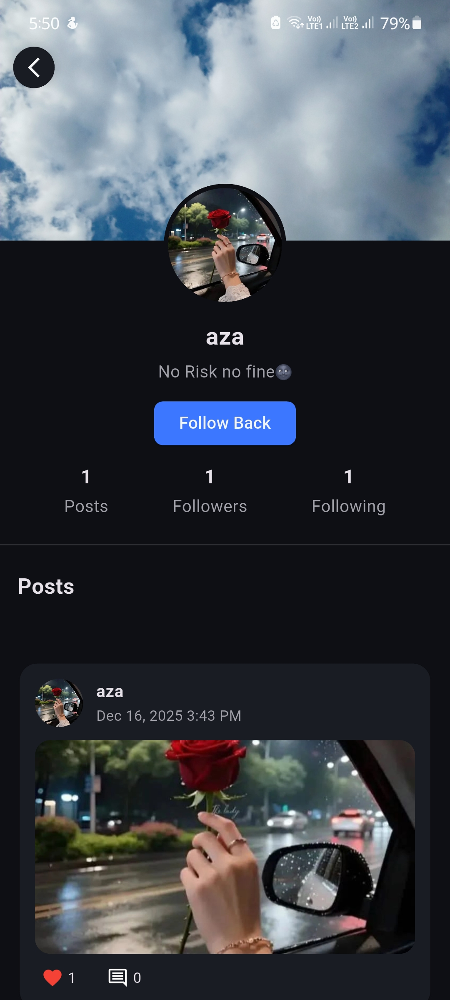
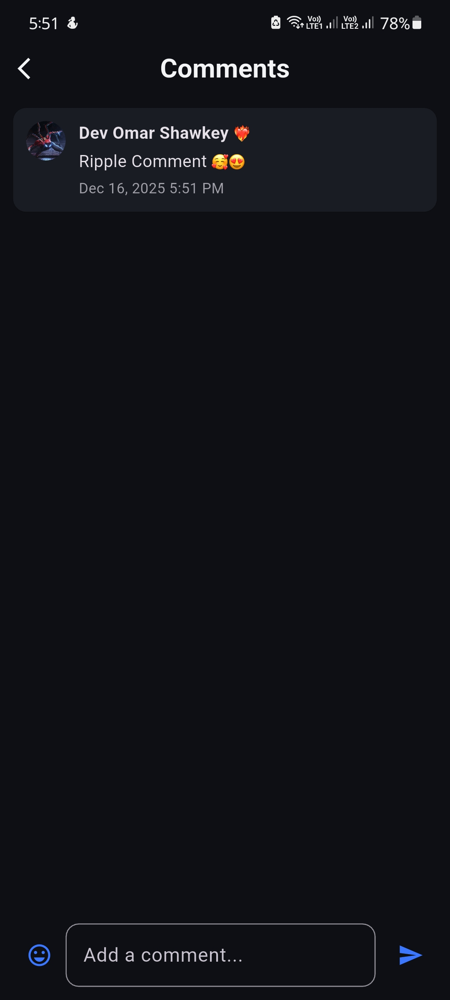

# Ripple 🌊

Ripple is a modern **Flutter social application** built with a strong focus on **clean architecture**, **scalability**, and **production-ready patterns**. The project is designed to reflect real-world application structure rather than a tutorial-style implementation, making it suitable for long-term growth and maintenance.

Ripple demonstrates how to build a social platform using Flutter, Firebase, and OneSignal while keeping the codebase modular, readable, and easy to evolve.

---

## ✨ What Makes Ripple Special

* 🧠 **Clean & Scalable Architecture** inspired by Clean Architecture principles
* 🔄 **Predictable state management** using BLoC
* 🔔 **Real-time push notifications** using OneSignal
* 🌍 **Multi-language support (Arabic & English)**
* 🧩 **Modular feature-based structure**
* 🚀 Built as a **real product**, not a demo

---

## 🚀 Features

* **Onboarding**
  Smooth introduction experience for first-time users.

* **User Authentication**
  Secure login and registration using Firebase Authentication.

* **Profile Management**
  View and edit user profiles, including profile and cover images.

* **Home Feed**
  A dynamic feed displaying user-generated posts.

* **Posts Interaction**
  Like and comment on posts in real time.

* **Follow System**
  Follow and unfollow users with instant updates.

* **Settings**
  Manage application preferences such as language and theme.

* **Push Notifications**
  Real-time notifications for:

    * Likes ❤️
    * Comments 💬
    * Follows 👤
      Powered by **OneSignal**.

---

## 🏗 Architecture Overview

Ripple follows **Clean Architecture concepts** to enforce separation of concerns and improve maintainability.

### 🧱 Presentation Layer

* **Location**: `lib/features/*/presentation/`

* **Responsibility**:

    * UI screens and widgets
    * User interaction handling
    * State management

* **State Management**:

    * Uses **BLoC (flutter_bloc)** for predictable and testable state handling

---

### 🧩 Core & Shared Layer

* **Location**: `lib/core/`
* **Contains**:

    * `di` → Dependency Injection using **get_it**
    * `theme` → Colors, typography, and UI styles
    * `utils` → Helpers, constants, extensions
    * `models` → Shared data models
    * `network` → Repositories & services (Firebase, OneSignal)

> Note: The domain and data responsibilities are logically separated and implemented within the core and feature layers to keep the project pragmatic and flexible.

---

## 🔔 Push Notifications

Ripple uses **OneSignal** for push notifications.

### Supported Notifications

* ❤️ Like notifications
* 💬 Comment notifications
* 👤 Follow notifications

### Key Characteristics

* Triggered from client-side events
* Linked using `external_user_id`
* Payload-based navigation handling
* Language-aware notifications (Arabic / English)

---

## 🌍 Localization

* Supports **Arabic** and **English**
* Language preference is stored per user
* Notifications respect the selected app language

---

## 📦 Tech Stack & Dependencies

### 🛠 Core

* Flutter
* Dart

### 🔄 State Management

* bloc
* flutter_bloc

### 🔐 Backend & Database

* firebase_core
* firebase_auth
* cloud_firestore

### 🔔 Notifications

* onesignal_flutter

### 🌐 Networking

* http

### 🖼 Media & UI

* image_picker
* cached_network_image

### 💾 Local Storage

* shared_preferences

### 🌍 Localization

* intl

### ⚙ Tooling

* get_it
* flutter_launcher_icons
* flutter_native_splash

---

## 📸 Screenshots

| Home Feed                        | Profile                             | Comments                             |
|----------------------------------|-------------------------------------|--------------------------------------|
|  |  |  |

---

## 🏁 Getting Started

### Prerequisites

* Flutter SDK
* Android Studio or VS Code
* Firebase project configured
* OneSignal account

---

### Installation

1. Clone the repository

   ```sh
   git clone https://github.com/OmarShawkey13/ripple.git
   ```

2. Navigate to the project directory

   ```sh
   cd ripple
   ```

3. Install dependencies

   ```sh
   flutter pub get
   ```

4. Configure Firebase

    * Add `google-services.json` for Android

5. Configure OneSignal

    * Add your OneSignal App ID
    * Set up notification icons

6. Run the app

   ```sh
   flutter run
   ```

---

## 📌 Notes

* This project is actively evolving
* Architecture decisions favor scalability over simplicity
* Designed to be easily extended with backend services or cloud functions

---

## 🧑‍💻 Author

**Omar Shawkey**
Flutter Developer

---

## ⭐ Support

If you like this project, consider giving it a ⭐ on GitHub — it helps a lot!
