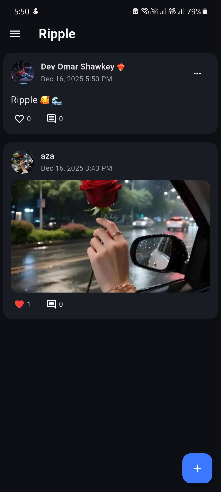
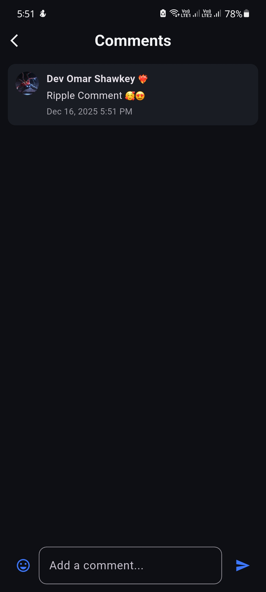

# Ripple 🌊

Ripple is a modern **Flutter social application** built with a strong focus on **clean architecture**, **scalability**, and **production-ready patterns**. The project is designed to reflect real-world application structure, making it suitable for long-term growth and maintenance.

Ripple demonstrates how to build a social platform using Flutter and Firebase while keeping the codebase modular, readable, and easy to evolve.

---

## ✨ What Makes Ripple Special

* 🧠 **Clean & Scalable Architecture** inspired by Clean Architecture principles.
* 🔄 **Predictable state management** using BLoC.
* 🔔 **Real-time push notifications** using Firebase Cloud Messaging (FCM) via HTTP v1 API.
* 🌍 **Multi-language support (Arabic & English)**.
* 🧩 **Modular feature-based structure**.
* 🚀 Built as a **real product**, not a demo.

---

## 🚀 Features

* **Entry & Routing Management**
  Intelligent routing that handles Onboarding flow and Firebase Auth state automatically.

* **Onboarding**
  Smooth introduction experience for first-time users.

* **User Authentication**
  Secure login and registration using Firebase Authentication.

* **Profile Management**
  View and edit user profiles, including profile and cover images with Cloudinary integration.

* **Home Feed**
  A dynamic feed displaying user-generated posts with real-time updates.

* **Posts Interaction**
  Create, **Edit**, and Delete posts. Like and comment on posts in real time.

* **Custom Emoji Support**
  Enhanced user experience with a custom-built Emoji picker for posts and comments.

* **Follow System**
  Follow and unfollow users with instant UI updates.

* **In-App Notifications**
  A dedicated notification center to track likes, comments, and new followers.

* **Settings**
  Manage application preferences such as language and theme (Light/Dark).

---

## 🏗 Architecture Overview

Ripple follows a **Layered Feature-based Architecture** to enforce separation of concerns.

### 🧱 Presentation Layer
* **Location**: `lib/features/*/presentation/`
* **Responsibility**: UI screens, widgets, and state management using **BLoC**.

### 🧩 Core Layer
* **Location**: `lib/core/`
* **Contains**:
    * `network` → Repositories & services (Firebase, FCM v1, Cloudinary).
    * `models` → Data models (Post, User, Notification, Comment).
    * `theme` → Dynamic UI styling and colors.
    * `utils` → Helpers, constants, and global Cubits.

---

## 🔔 Push Notifications

Ripple uses **Firebase Cloud Messaging (FCM)** with a secure implementation of the **HTTP v1 API**.

### Supported Notifications
* ❤️ **Likes**: Triggered when someone likes your post.
* 💬 **Comments**: Triggered when someone comments on your post.
* 👤 **Follows**: Triggered when someone starts following you.

### Key Characteristics
* Uses **Google OAuth 2.0** (`googleapis_auth`) for secure server-side messaging.
* Integrated with **Flutter Local Notifications** for foreground alerts.
* Payload-based navigation (e.g., clicking a comment notification opens the post's comment section).
* Multi-language support in notification content.

---

## 📦 Tech Stack & Dependencies

### 🔄 State Management
* `bloc` & `flutter_bloc`

### 🔐 Backend & Database
* `firebase_core`, `firebase_auth`, `cloud_firestore`

### 🔔 Notifications & Auth
* `firebase_messaging`
* `flutter_local_notifications`
* `googleapis_auth` (FCM v1 Secure Messaging)

### 🌐 Networking & Media
* `http`
* `image_picker`
* `cached_network_image`
* **Cloudinary** (Image Hosting)

### 💾 Local Storage
* `shared_preferences`

---

## 📸 Screenshots

| Home Feed | Profile | Notifications |
| :--- | :--- | :--- |
|  |  |  |

---

## 🏁 Getting Started

### Installation
1. Clone the repository: `git clone https://github.com/OmarShawkey13/ripple.git`
2. Install dependencies: `flutter pub get`
3. Configure Firebase: Add `google-services.json` to the Android app directory.
4. FCM Credentials: Place your Firebase Service Account JSON in `assets/firebase/` for notification support.
5. Run the app: `flutter run`

---

## 🧑‍💻 Author
**Omar Shawkey**
Flutter Developer

---

## ⭐ Support
If you like this project, consider giving it a ⭐ on GitHub!
