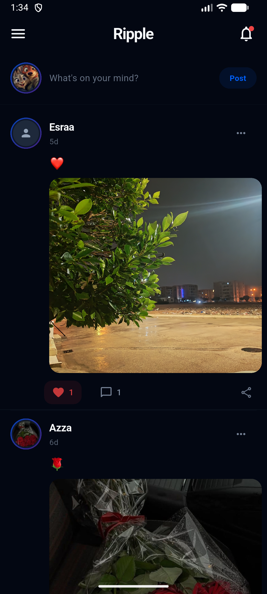
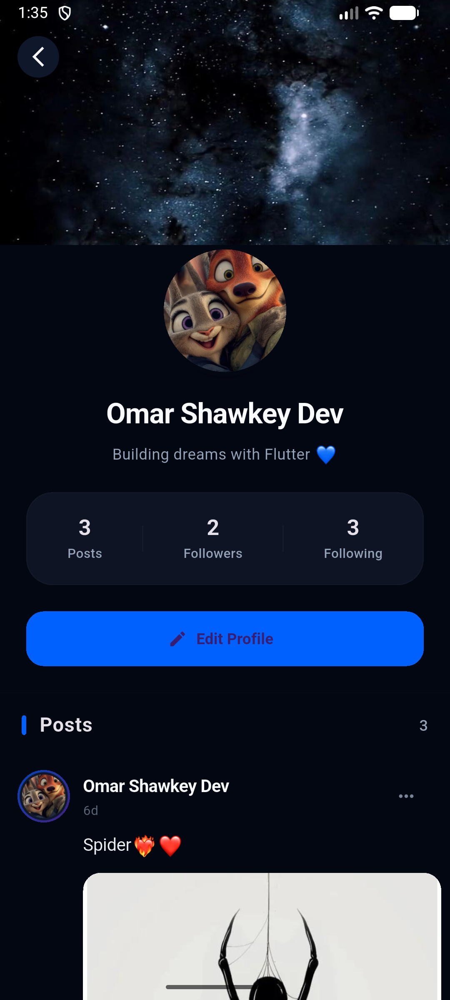
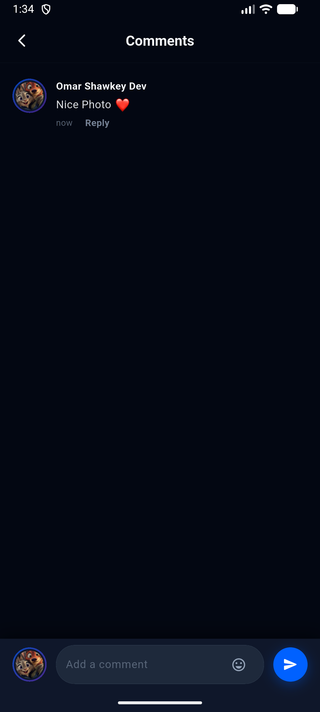
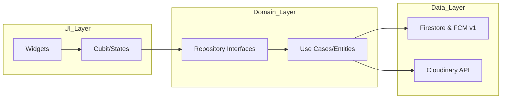

# Ripple 🌊 | High-Performance Social Media Ecosystem

<p align="center">
  
  <br>
  <b>An Enterprise-Grade Social Experience built with Flutter & Firebase.</b>
  <br>
  <i>"Engineered for Scalability, Designed for Elegance."</i>
</p>

<p align="center">
  
  
  
  
</p>

---

## 🚀 Architectural Vision

**Ripple** isn't just an app; it's a technical manifesto. It demonstrates how to build a scalable social network using modern software engineering principles.

### 💎 Technical Core
*   **FCM v1 Enterprise Messaging**: Implemented the latest **HTTP v1 API** with **Google OAuth 2.0** for secure, server-side notification delivery.
*   **Feature-First Clean Architecture**: Decoupled modules (Auth, Feed, Profile) ensuring 100% testability and independent scaling.
*   **Sub-collection Optimization**: Advanced Firestore schema design using sub-collections for Comments and Replies to minimize document size and optimize read costs.
*   **Dynamic UI Engine**: A custom-built theming and localization system that handles RTL (Arabic) and LTR (English) transitions instantly without state loss.
*   **Cloudinary Media Stack**: High-speed image transformation and CDN delivery integrated via Cloudinary API.

---

## 📸 Premium UI Showcase

<div align="center">
  <table>
    <tr>
      <td align="center"><b>🏠 Dynamic Feed</b></td>
      <td align="center"><b>👤 User Profile</b></td>
      <td align="center"><b>💬 Real-time Engagement</b></td>
    </tr>
    <tr>
      <td></td>
      <td></td>
      <td></td>
    </tr>
  </table>
</div>

---

## 🏗 System Design & Engineering

The application is built on a **Modular Clean Architecture** to ensure that business logic is completely isolated from the UI and external frameworks.

### Engineering Layers:
1.  **Presentation Layer**: `Cubit` (BLoC) for state management with optimized `buildWhen` logic to prevent redundant UI jank.
2.  **Domain Layer**: Pure Dart entities and repository interfaces defining the "What" of the application.
3.  **Data Layer**: Implementation of repositories, handling Firestore streams, Cloudinary uploads, and Local Caching.


```mermaid
graph LR
    subgraph UI_Layer
    A[Widgets] --> B[Cubit/States]
    end
    subgraph Domain_Layer
    B --> C[Repository Interfaces]
    C --> D[Use Cases/Entities]
    end
    subgraph Data_Layer
    D --> E[Firestore & FCM v1]
    D --> F[Cloudinary API]
    end
```

---

## 🛠 Tech Stack

*   **Core**: Flutter Stable (Dart)
*   **State Management**: BLoC / Cubit (Production Pattern)
*   **Backend**: Firebase (Authentication, Firestore, Messaging v1)
*   **Storage & CDN**: Cloudinary
*   **DI**: GetIt (Service Locator)
*   **Architecture Patterns**: Repository Pattern, Factory, Singleton, Observer

---

## 📊 GitHub Contribution & Stats

<p align="center">
  
  <br>
  
</p>

---

## 📂 Project Structure (The Architecture)

The project is engineered using a **Feature-First Modular Clean Architecture**, ensuring strict separation between core infrastructure and business features.

```bash
lib/
├── core/
│   ├── di/               # Dependency Injection (GetIt) & Service Locator
│   ├── models/           # Data Transfer Objects (User, Post, Comment models)
│   ├── network/          # Data Layer: Repositories & External Services (Firebase, Cloudinary)
│   ├── theme/            # Design System: ColorsManager, TextStylesManager, & AppTheme
│   └── utils/
│       ├── constants/    # Spacing Manager, Routes, & Localized Constants
│       │   └── primary/  # Atomic Reusable Components (ConditionalBuilder, etc.)
│       └── cubit/        # Global Logic (ThemeCubit, AuthCubit, HomeCubit)
└── features/
    ├── home/             # Presentation Layer: Infinite Feed, Posting, & Engagement
    ├── profile/          # User Identity, Social Graph, & Account Settings
    ├── login/register/   # Secure Authentication Modular Flow
    └── on_boarding/      # Premium UX Entry Experience
```

---

## 🏁 Getting Started

1.  **Clone**: `git clone https://github.com/OmarShawkey13/ripple.git`
2.  **Config**: Add `google-services.json` and FCM v1 Service Account keys.
3.  **Deploy**: `flutter pub get` && `flutter run --release`

---

## 👨‍💻 Developed By
**Omar Shawkey** - *Senior Flutter Engineer*

[](https://github.com/OmarShawkey13)
[](https://linkedin.com/in/omarshawkey)

> "True engineering is making the complex seem simple. Ripple is a testament to that."

---
⭐ **Star this repository if you find this architecture helpful!**
